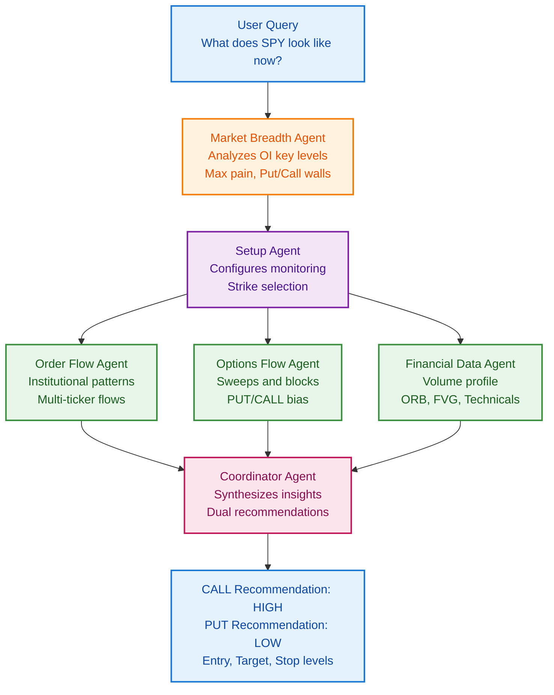
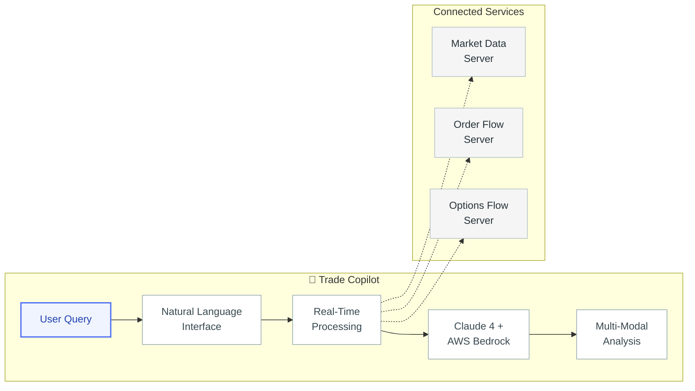

[](https://opensource.org/licenses/MIT)
[](https://aws.amazon.com/bedrock/)
[](https://github.com/fintools-ai)
[](https://www.linkedin.com/in/sayantanbhow/)


```
███████╗██╗███╗   ██╗████████╗ ██████╗  ██████╗ ██╗     ███████╗       █████╗ ██╗
██╔════╝██║████╗  ██║╚══██╔══╝██╔═══██╗██╔═══██╗██║     ██╔════╝      ██╔══██╗██║
█████╗  ██║██╔██╗ ██║   ██║   ██║   ██║██║   ██║██║     ███████╗█████╗███████║██║
██╔══╝  ██║██║╚██╗██║   ██║   ██║   ██║██║   ██║██║     ╚════██║╚════╝██╔══██║██║
██║     ██║██║ ╚████║   ██║   ╚██████╔╝╚██████╔╝███████╗███████║      ██║  ██║██║
╚═╝     ╚═╝╚═╝  ╚═══╝   ╚═╝    ╚═════╝  ╚═════╝ ╚══════╝╚══════╝      ╚═╝  ╚═╝╚═╝

```


## 🌟 **What I'm Building**

**fintools-ai** is an ecosystem of microservices and AI agents that transforms raw market data into **actionable, explainable insights**. 

The mission is simple: **Make complex market data easy to understand and act on.**

---

## 🧠 **Key Products**

| Product | What It Does | Status |
|---------|--------------|---------|
| **🏆 [Trade Copilot v2](https://github.com/fintools-ai/trade-copilot-agent-swarm)** | Conversational AI that explains real-time order flow and technicals for any ticker in seconds  | **Testing** 🔒 |
| **🏆 Trade Copilot** | Conversational AI that explains real-time order flow and technicals for any ticker in seconds | **Private Beta** 🔒 |
| **📊 OI Analysis Copilot** | Pinpoints where institutions are concentrating options exposure | Coming Soon |
| **🌊 Technical Data Servers** | High-speed bid/ask momentum, sweep detection, absorption patterns & more | **Private Beta** 🔒 |


---


## Disclaimer
This project is for educational and research purposes only.

- Not intended for real trading or investment
- No investment advice or guarantees provided
- Creator assumes no liability for financial losses
- Consult a financial advisor for investment decisions
- Past performance does not indicate future results
- By using any  software part of fintools, you agree to use it solely for learning purposes.


## 🚀 **Trade Copilot v2: The Agent Swarm Revolution**

Trade Copilot v2 represents a complete architectural redesign, moving from a single-agent system to a **multi-agent swarm** that delivers significantly higher accuracy and confidence in trading recommendations.

Code Repo - https://github.com/fintools-ai/trade-copilot-agent-swarm

### **What's New in v2**

#### **Multi-Agent Swarm Architecture**
Instead of one agent trying to analyze everything, v2 deploys a **team of multiple specialized agents** that work in parallel:




## 🚀 **First Up: Trade Copilot**

Trade Copilot is one of the first product of the fintools-ai suite. It's just the beginning. I'm building a collection of specialized AI assistants, each designed to simplify different aspects of trading.

### **Why Trade Copilot Leads the Pack**

Trade Copilot tackles the trader's biggest pain point: turning a firehose of real-time data into an actionable story.



**What Trade Copilot Does:**
- **Natural Language Interface** — Ask questions in plain English about market data
- **Real-Time Processing** — Analyzes current market activity as it happens
- **Clear Explanations** — Breaks down complex data into understandable insights
- **Comprehensive View** — Combines multiple data sources for complete analysis

### **📊 Coming Soon: More Specialized Assistants**

- **OI Analysis Copilot** — Deep dive into open interest patterns and create trade plans based on options positioning

Each tool focuses on making one aspect of trading simpler and more data-driven.

---

## 🛠️ **The Technology Stack**

```
╔═══════════════════════════════════════════════════════════════════════════╗
║                         fintools-ai Architecture                          ║
╚═══════════════════════════════════════════════════════════════════════════╝

┌─────────────────┐      ┌──────────────────┐      ┌─────────────────────┐
│  🌐 Data Layer  │      │ 🔧 Processing    │      │ 📱 User Interface   │
├─────────────────┤      ├──────────────────┤      ├─────────────────────┤
│                 │      │                  │      │                     │
│ • 3P Market     │─────▶│ Go Data Broker   │─────▶│ • Trade Copilot     │
│   Data APIs     │      │ (Real-time)      │      │ • Web Dashboard     │
│ • WebSocket     │      │                  │      │ • Mobile Apps       │
│   Feeds         │      │ • gRPC Server    │      │   (Coming Soon)     │
│ • REST APIs     │      │ • Redis Cache    │      │                     │
│                 │      │ • Event Stream   │      │                     │
└─────────────────┘      └────────┬─────────┘      └─────────────────────┘
                                  │
                         ┌────────▼─────────┐
                         │  📡 MCP Servers  │
                         ├──────────────────┤
                         │                  │
                         │ • Market Data    │
                         │ • Order Flow     │
                         │ • Options Flow   │
                         │ • Open Interest  │
                         │                  │
                         └────────┬─────────┘
                                  │
                         ┌────────▼─────────┐
                         │  🧠 AI Layer     │
                         ├──────────────────┤
                         │                  │
                         │ • Claude 4       │
                         │ • AWS Bedrock    │
                         │ • Pattern Recog. │
                         │ • ML Models      │
                         │                  │
                         └──────────────────┘
```

---

## 🔧 **Core Tools & Servers**

> **📋 Beta Notice:** Several repositories are currently private during beta testing and will be made public upon stable release. 


#### **[Trade Copilot](https://github.com/fintools-ai/trade-copilot)** 
> **The AI trading assistant that analyzes markets and help generated insights from raw real time market data**

- **Status**: Private Beta — Repository will be public soon
- **Tech Stack**: Python, FastMCP, Claude 4, Go, gRPC, WebSockets
- **Key Features**:
  - Real-time order flow analysis
  - Options sweep detection
  - Volume profile analysis
  - Institutional bias tracking
  - Natural language queries

---

### **📊 Market Data Infrastructure**

#### **[mcp-market-data-server](https://github.com/fintools-ai/mcp-market-data-server)** ⭐ 
> **Comprehensive financial market data analysis for LLM agents**

```python
# Example: Get volume profile in natural language
result = await mcp_client.call_tool("financial_volume_profile_tool", {
    "symbol": "AAPL",
    "timeframe": "5m"
})
# Returns: POC, VAH, VAL, and high-volume nodes with explanations
```

- **Tools**: Volume Profile, Technical Analysis, Support/Resistance Zones
- **Integration**: FastMCP protocol, 3P market data APIs
- **Use Cases**: Pattern recognition, price level identification

#### **[FinancialDataMCP](https://github.com/fintools-ai/FinancialDataMCP)** 
> **Standalone server for AI trading agents**

- **Purpose**: Bridge between external brokers and AI systems
- **Architecture**: Modular, scalable data processing
- **Output**: Structured insights for LLM consumption

#### **[TradeInsightsAssistant](https://github.com/fintools-ai/TradeInsightsAssistant)** 
> **Chat-based Open Interest analysis**

- **Focus**: Daily OI trends and positioning analysis
- **Interface**: Natural language queries for options data
- **Insights**: Support/resistance from options positioning

---

### **Order Flow Intelligence** 

#### **mcp-order-flow-server** 
> **Real-time order flow analysis and institutional tracking**

**Key Features:**
- 🔄 **Bid/Ask Momentum Analysis** — Track buying vs selling pressure
- 📊 **Large Order Detection** — Identify institutional-sized trades
- 🎯 **Absorption Pattern Recognition** — Spot accumulation/distribution
- 🏢 **Market Maker vs Retail Classification** — Know who's trading

#### **mcp-options-order-flow-server** 
> **Options market intelligence and sweep detection**

**Key Features:**
- 🎯 **Institutional Sweep Detection** — Catch large options orders
- 📈 **Put/Call Bias Analysis** — Market sentiment indicators
- ⚡ **Gamma Positioning Insights** — Understand dealer hedging
- 💰 **Smart Money Flow Tracking** — Follow institutional positioning

#### **mcp-openinterest-server** 
> **Dedicated Open Interest data pipeline**

- **Purpose**: Fetch and process OI data for analysis
- **Integration**: Feeds into OI Analysis Copilot
- **Updates**: Real-time OI change detection

---

## 🏆 **Why fintools-ai Is Different**

### **🧠 AI-First Architecture**
- **Conversational Interface** — Ask questions in plain English
- **Explainable AI** — Understand *why*, not just *what*
- **Continuous Learning** — Patterns improve with market data
- **Multi-Modal Analysis** — Text, charts, and data combined


### **🔧 Modular Design**
- Use only the services you need
- Easy integration with existing tools

---


---

## 🚀 **Getting Started**

**Currently in Beta Development** 🚧

I'm actively building the future of AI-powered trading analysis. Core systems are in development and being tested with early adopters.


---

## 👨‍💻 **About the Creator**


**Connect:**
- 📧 [sayantanbhow@gmail.com](mailto:sayantanbhow@gmail.com)
- 💼 [LinkedIn](https://www.linkedin.com/in/sayantanbhow/)
- 🐙 [GitHub](https://github.com/fintools-ai)

---

## ⚖️ **Legal & Compliance**

**Important Notice:** 
- 📋 **Not Financial Advice** — Tools provide data analysis, not investment recommendations
- 🔒 **Risk Disclaimer** — Trading involves substantial risk of loss
- 📊 **Data Accuracy** — While we strive for accuracy, verify all data independently


---

<div align="center">

### **🚀 The Future of Trading is AI-Powered**

*Built with passion for trading and technology*


</div>
